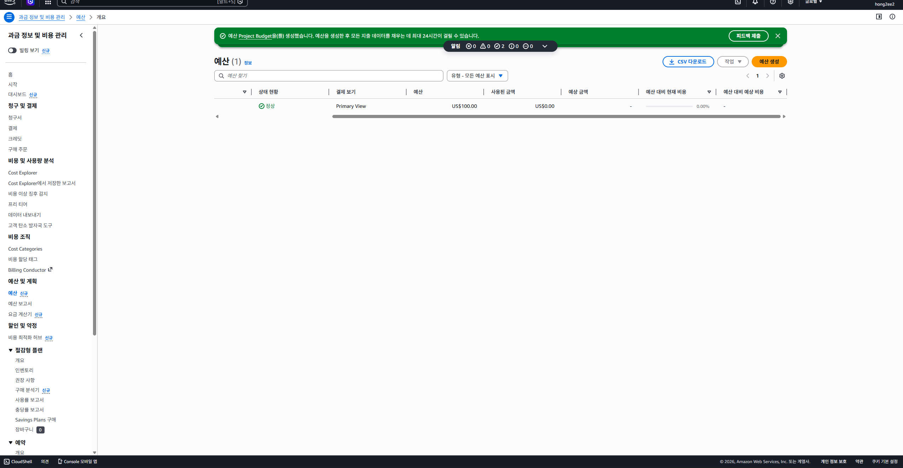
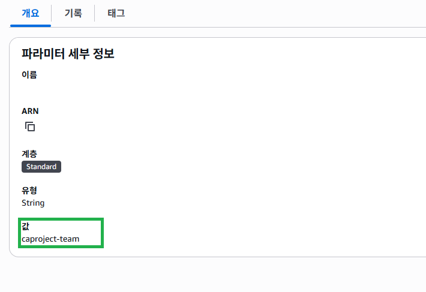
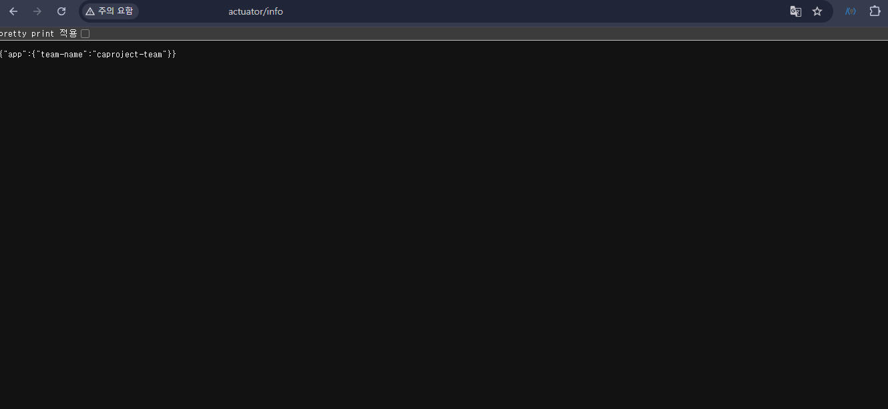
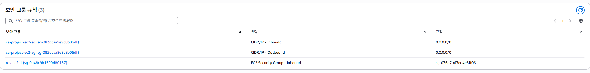
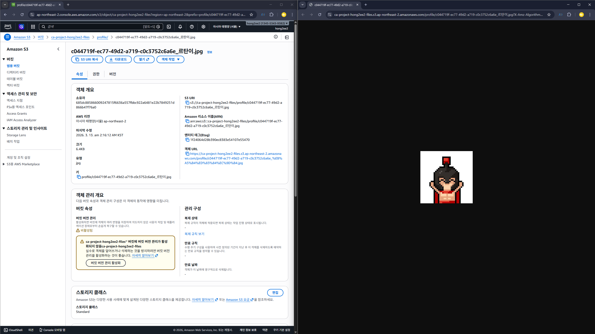
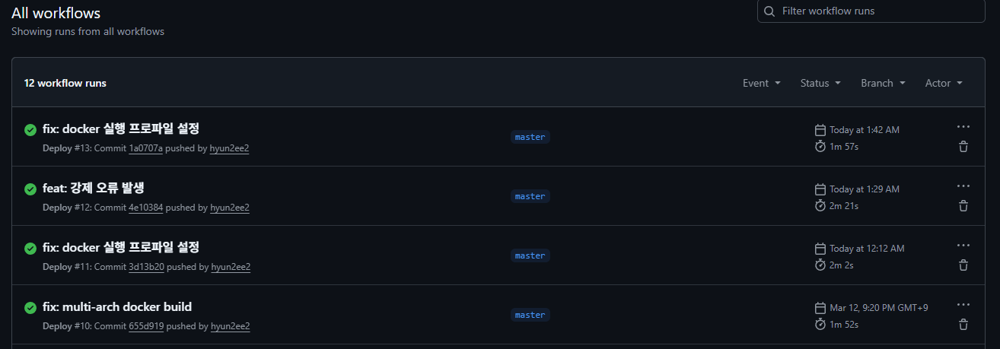
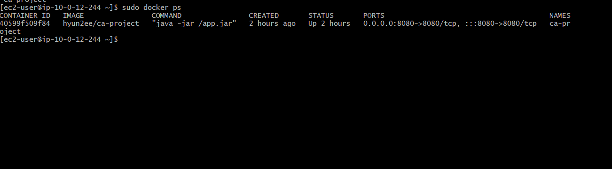

# 클라우드 기반 아키텍처 설계 & 배포 프로젝트

---

## 프로젝트 소개
이번 프로젝트는 AWS 클라우드 환경에서 Spring Boot 기반 백엔드 애플리케이션을 설계하고 배포하는 과정을 공부하였습니다.

 

### 프로젝트 진행 기간

- 2026.03.09(월) ~ 2026.03.10(화) : `클라우드 기반 백엔드 설계` 강의 시청
- 2026.03.10(화) : 필수과제 Lv.1 진행
- 2026.03.11(수) : 필수과제 Lv.2, Lv.3 진행
- 2026.03.12(목) : 도전과제 Lv.4 진행, 트러블 슈팅 작성
- 2026.03.13(금) : `README.md` 정리

 

### 프로젝트 목적
- 클라우드 환경 이해 및 활용
- 배포 자동화 및 운영 실습
- 보안 및 민감 정보 관리
- 실무형 아키텍처 설계 경험

---

## 문제

 

### 1. 설정 완료된 AWS Budgets 화면을 캡처하여 **README.md**에 첨부하세요
설정 완료된 EC2의 퍼블릭 IP 를 README.md에 첨부하세요.

 

### 2. Actuator Info 엔드포인트 URL
`/actuator/info`에 접속했을 때, Parameter Store에 저장했던 또는 확인용 파라미터 값이 JSON으로 출력되는 URL을 README.md에 작성하세요.
(예: `http://3.34.xx.xx:8080/actuator/info`)

 

### 3. RDS 보안 그룹 스크린샷
AWS 콘솔 > RDS > 보안 그룹 > **[인바운드 규칙]** 탭을 캡처하세요.
소스(Source) 부분에 IP 주소(`0.0.0.0/0`)가 아닌, EC2의 보안 그룹 ID (`sg-xxxxx`)가 등록되어 있음을 보여주어야 합니다.

 

### 4. Presigned URL은 유효기간이 지나면 접근이 불가능합니다. 채점을 위해 **과제 제출일 기준 유효한 URL**을 새롭게 생성해야 합니다.

> 🚨 유효기간 7일 설정 필수!

발급받은 **Presigned URL 1개**와 해당 URL의 만료 시간을 README.md에 기재하세요.
IAM Role로 진행하신 수강생의 경우는 발제에서 요구하는 Presigned URL 대신, 접근 성공 스크린샷을 확보하여 README.md 에 첨부 부탁드리겠습니다.

#### S3 파일 접근 성공 확인 (IAM Role 방식)
S3에 업로드된 파일을 브라우저 URL로 접근하여 정상적으로 조회되는 것을 확인했습니다.

 

### 5. Github Actions 성공 이미지
Github Repository > Actions 탭에서 배포 워크플로우가 초록색 체크`Success`로 표시된 화면을 캡처 후 README.md에 올려 주세요.

 

### 6.  EC2 터미널 이미지
EC2에 접속하여 `sudo docker ps` 명령어를 입력했을 때, 실행 중인 컨테이너 목록이 나오는 화면을 캡처 후 README.md에 올려 주세요.

---

## 트러블 슈팅 & GITHUB
[티스토리 바로가기](https://hyunspaceworkshop.tistory.com/26)

[GITHUB 바로가기](https://github.com/hyun2ee2/cloud-architecture-project)

